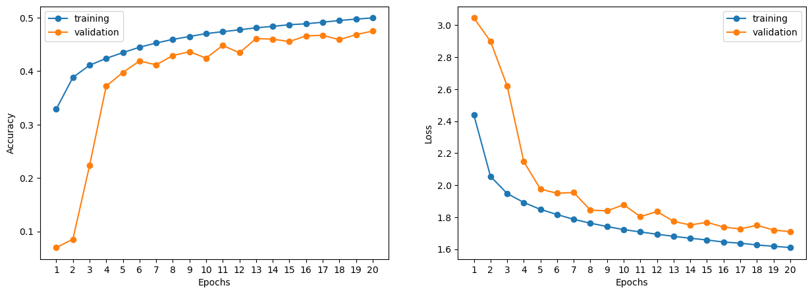
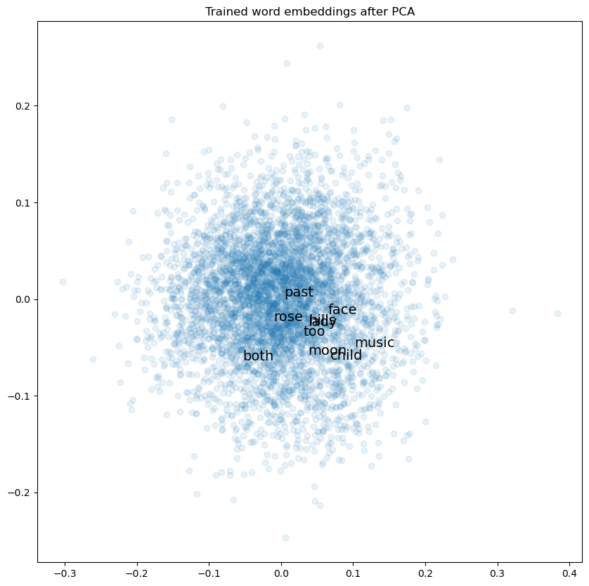

<div id="container" style="position:relative;">
<div style="float:left"><h1> Introduction to Recurrent Neural Networks </h1></div>
<div style="position:relative; float:right">
</div>
</div>

So far we have seen Fully-Connected Neural Networks (FNN) as well as Convolutional Neural Networks (CNN). These were powerful methods but neither work well on sequential data where the ordering of inputs matter. Sequential data and its analysis is ubiquitous in modern data science and machine learning:
- time series data: forecasting stock price movements or weather patterns;
- natural language: automated question answering, text summarization or translating sentences from one language to the other;
- audio or video data: turning speech into text or annotating videos;
- mobility data: analyzing traffic patterns or traffic behavior prediction for self-driving cars.

These applications all require us to model a sequence of inputs where previous values heavily affect future elements. This is where Recurrent Neural Networks (RNN) come into play.


```python
# Let's load up some libraries
import os.path

import numpy as np
import pandas as pd
import matplotlib.pyplot as plt

from tensorflow.keras.models import Sequential
from tensorflow.keras.layers import Dense, Dropout, Embedding, LSTM, GRU, BatchNormalization
from tensorflow.keras.optimizers import Adam
from tensorflow.keras.preprocessing.text import Tokenizer
```

    C:\Users\xieyj\anaconda3\envs\deeplearning\lib\site-packages\scipy\__init__.py:146: UserWarning: A NumPy version >=1.16.5 and <1.23.0 is required for this version of SciPy (detected version 1.23.3
      warnings.warn(f"A NumPy version >={np_minversion} and <{np_maxversion}"
    

## Modeling Sequential Data

When working with sequential data, we assume that the data points are not independent. In general, when observing $\vec{X} = [x_1, x_2, ..., x_n]$ across $n$ time steps, every $x_t$ has an effect on the next $x_{t+1}$ and knowing more of the past data points allows us to make better predictions of future values. Natural language is even more complex because the order of the words has a tremendous effect on meaning. Both the previous and the following words matter when interpreting a word, (_bidirectional context_). 

Consider the following two sentences:
1. A person made a neural network.
2. A neural network made a person.

The two sentences contain the exact same words but have very different meaning.


## Effects on Neural Network design

From a functional perspective, we would like our neurons to be slightly modified. The fully-connected and convolutional neural networks that we discussed so far were so-called **feed-forward neural networks**. Starting at the input layer, information flowed from one direction towards the output, (see the right diagram). Now, as we aim to process a _sequential_ input, we would like to design our neurons such that the output from one sequence element can be used as an input for processing the next element. This can be achieved by adding backward (or in other words, recurrent) connections into the network design, (see the left diagram).


<center> <i>Image source: https://www.sciencedirect.com/science/article/pii/S088523081400093X#fig0010</i> </center>

The basis for Recurrent Neural Networks are these Recurrent Neurons, represented by a function $F$ below. So, in the simplest case, a sequence of inputs $[x_0, x_1, x_2, \dots]$ is processed using the formula

$$y_t = F(x_t, y_{t-1})$$

That is, in order to find the output at step $t$, we use both the input at step $t$ and the previous output. This recurrent processing step is depicted on the diagram left below. However, when we actually process a sequence, we **unroll this computation** (as shown on the right diagram): 


For example, to process a four-element sequence $[x_0, x_1, x_2, x_3]$, the network would make the following calculations:

$$
y_0 = F(x_0, \underline 0) \\
y_1 = F(x_1, y_{0}) \\
y_2 = F(x_2, y_{1}) \\
y_3 = F(x_3, y_{2}) \\
$$

In the first step, since we don't have an output yet, we just feed in $x_0$ and zeros, to produce the first output $y_0$. Next, we process $x_1$ together with $y_0$ to get $y_1$. Since $y_0$ was found using $x_0$, the output $y_1$ will depend on both $x_1$ and $x_0$. Next, $y_2$ is calculated using $x_2$ and the previous output $y_1$. Since $y_1$ has information about both $x_1$ and $x_0$, the output $y_2$ is affected by the whole sequence before. So recurrent neural networks achieve a sort of memory.


You can see that a great advantage of RNNs compared to feed-forward networks is that they can **process sequences of different lengths** without changing anything about the network. We don't need more parameters, since we are sharing the same function (i.e. the same weights) across the different steps.

Modern recurrent neurons go one step further and distinguish a separate output and an internal **memory** or **cell state**, also known as a **hidden state**, which is used to compute the next value. More formally, these recurrent neurons are functions $F$ that take an input $x_t$ and previous internal state $h_{t-1}$ and return the output $y_t$ along with the updated state $h_t$:

$$y_t, h_t = F(x_t, h_{t-1})$$

So our diagrams slightly change:


The unrolled computation for the four-element sequence $[x_0, x_1, x_2, x_3]$ will look like this:

$$
y_0, h_0 = F(x_0, \underline 0)\\
y_1, h_1 = F(x_1, h_{0})\\
y_2, h_2 = F(x_2, h_{1})\\
y_3, h_3 = F(x_3, h_{2})\\
$$

The essence is the same. This processing allows us to have the value of $y_3$ depend on the whole input sequence, because information from each of the $x_i$ values was extracted into the hidden state throughout the processing.


When we intend to produce a single prediction only (i.e. the sentiment of a document), we often ignore the intermediate outputs and make use of the final output only, which incorporates the whole sequence:


These models are referred to _sequence-to-vector models_ while models where both the input and output is sequential (such as the case of machine translation or speech-to-text models) are called _sequence-to-sequence_.

Finally, multiple RNN layers can be stacked to form deep recurrent neural networks:

</img>

The first layer will pass the whole output sequence to the second layer (and the second layer to the third, and so on). This allows the network to model more complex relationships with the price of more parameters and a higher chance for overfitting. 

When **training recurrent neural networks**, we are working with the unrolled computational graph and apply backpropagation (this is called _backpropagation through time_). The trainable weights are hidden in the function $F$ we discussed in the form of matrices that transform the input and previous cell state to the output and updated state.

## Data Shapes

When we talk about sequential data, each of our observations is a sequence and each sequence element can have multiple features. (Imagine weather data where we observe air pressure, humidity, and temperature, each across multiple time steps). In general, the shape of the input for recurrent networks will be something like $n\times q \times d$ where 
- $n$ is the number of observations, 
- $q$ is the sequence length and 
- $d$ is the number of features for each element. 

These are called 3-dimensional arrays or _rank-3 tensors_.

So for example, if we have a dataset where every data point is made up of 4 input features, each of which is a series of 20 measurements (e.g. 20 days), then every data point is described by a $20 \times 4$ matrix. And if we have 1,000 data points, our dataset will be of size $1000 \times 20 \times 4$. 

## RNNs in Tensorflow and Keras

Keras provides three built-in RNN layers:

- `SimpleRNN`: This is the simplest recurrent neuron that we discussed earlier, where the previous output is fed back along with the input;

- `LSTM`: _Long-Short Term Memory_ units (introduced by [Hochreiter & Schmidhuber, 1997.](https://dl.acm.org/doi/10.1162/neco.1997.9.8.1735)) which improve on simple RNNs with advanced long-term memory updates;

- `GRU`: A _Gated Recurrent Unit_ architecture (see [Cho et al., 2014.](https://arxiv.org/abs/1406.1078)) which simplifies LSTMs but often work equally well.

As you can see, the computation inside LSTM units is much more elaborate than simple RNNs. In particular, there are two internal states calculated, in addition to the  cell output, and these states serve as a long-term memory which is updated at each step.


<center> <i>Image source: https://commons.wikimedia.org/wiki/File:Long_Short-Term_Memory.svg</i> </center>

## Let's write some poetry! (or at least try)

Let's say we wanted to produce an RNN which can write poetry for us. We will give it some starting phrase, and we expect it to complete a poem for us. 
There are two ways to explore this problem. We can look at poems (and language) as a sequence of characters, or as a sequence of words.

We will start with the simpler case - character sequences.

## Splitting the Data into Characters

The most important part of every data science project is getting the data and transforming it to our required format. Let's grab a poetry dataset:


```python
# original data source: https://www.kaggle.com/johnhallman/complete-poetryfoundationorg-dataset

poems_df = pd.read_csv('data/kaggle_poem_dataset.csv', index_col=0)
poems_df.head()
```


<div>
<style scoped>
    .dataframe tbody tr th:only-of-type {
        vertical-align: middle;
    }

    .dataframe tbody tr th {
        vertical-align: top;
    }

    .dataframe thead th {
        text-align: right;
    }
</style>
<table border="1" class="dataframe">
  <thead>
    <tr style="text-align: right;">
      <th></th>
      <th>Author</th>
      <th>Title</th>
      <th>Poetry Foundation ID</th>
      <th>Content</th>
    </tr>
  </thead>
  <tbody>
    <tr>
      <th>0</th>
      <td>Wendy Videlock</td>
      <td>!</td>
      <td>55489</td>
      <td>Dear Writers, I’m compiling the first in what ...</td>
    </tr>
    <tr>
      <th>1</th>
      <td>Hailey Leithauser</td>
      <td>0</td>
      <td>41729</td>
      <td>Philosophic\nin its complex, ovoid emptiness,\...</td>
    </tr>
    <tr>
      <th>2</th>
      <td>Jody Gladding</td>
      <td>1-800-FEAR</td>
      <td>57135</td>
      <td>We'd  like  to  talk  with  you  about  fear t...</td>
    </tr>
    <tr>
      <th>3</th>
      <td>Joseph Brodsky</td>
      <td>1 January 1965</td>
      <td>56736</td>
      <td>The Wise Men will unlearn your name.\nAbove yo...</td>
    </tr>
    <tr>
      <th>4</th>
      <td>Ted Berrigan</td>
      <td>3 Pages</td>
      <td>51624</td>
      <td>For Jack Collom\n10 Things I do Every Day\n\np...</td>
    </tr>
  </tbody>
</table>
</div>


Poetry is unique to every author, so we should see if we can find a single author in this dataset with a large collection of poems that we can use to train our models.


```python
poems_df['Author'].value_counts().head()
```


    William Shakespeare      85
    Anonymous                82
    Alfred, Lord Tennyson    78
    Rae Armantrout           62
    William Wordsworth       59
    Name: Author, dtype: int64


Not too surprising, William Shakespeare is the most frequent author but let's try a close third, Alfred Tennyson:


```python
filtered_poems = poems_df[poems_df['Author'] == "Alfred, Lord Tennyson"]
filtered_poems.head()
```


<div>
<style scoped>
    .dataframe tbody tr th:only-of-type {
        vertical-align: middle;
    }

    .dataframe tbody tr th {
        vertical-align: top;
    }

    .dataframe thead th {
        text-align: right;
    }
</style>
<table border="1" class="dataframe">
  <thead>
    <tr style="text-align: right;">
      <th></th>
      <th>Author</th>
      <th>Title</th>
      <th>Poetry Foundation ID</th>
      <th>Content</th>
    </tr>
  </thead>
  <tbody>
    <tr>
      <th>1730</th>
      <td>Alfred, Lord Tennyson</td>
      <td>Break, Break, Break</td>
      <td>45318</td>
      <td>Break, break, break,\nOn thy cold gray stones,...</td>
    </tr>
    <tr>
      <th>2134</th>
      <td>Alfred, Lord Tennyson</td>
      <td>The Charge of the Light Brigade</td>
      <td>45319</td>
      <td>I\n\nHalf a league, half a league,\nHalf a lea...</td>
    </tr>
    <tr>
      <th>2315</th>
      <td>Alfred, Lord Tennyson</td>
      <td>Claribel</td>
      <td>45320</td>
      <td>Where Claribel low-lieth\nThe breezes pause an...</td>
    </tr>
    <tr>
      <th>2687</th>
      <td>Alfred, Lord Tennyson</td>
      <td>Crossing the Bar\n \n \n  \n   Launch Audio in...</td>
      <td>45321</td>
      <td>Sunset and evening star,\nAnd one clear call f...</td>
    </tr>
    <tr>
      <th>3529</th>
      <td>Alfred, Lord Tennyson</td>
      <td>The Eagle</td>
      <td>45322</td>
      <td>He clasps the crag with crooked hands;\nClose ...</td>
    </tr>
  </tbody>
</table>
</div>


```python
print(filtered_poems.iloc[1,3])
```

    I
    
    Half a league, half a league,
    Half a league onward,
    All in the valley of Death
    Rode the six hundred.
    “Forward, the Light Brigade!
    Charge for the guns!” he said.
    Into the valley of Death
    Rode the six hundred.
    
    II
    
    “Forward, the Light Brigade!”
    Was there a man dismayed?
    Not though the soldier knew
    Someone had blundered.
    Theirs not to make reply,
    Theirs not to reason why,
    Theirs but to do and die.
    Into the valley of Death
    Rode the six hundred.
    
    III
    
    Cannon to right of them,
    Cannon to left of them,
    Cannon in front of them
    Volleyed and thundered;
    Stormed at with shot and shell,
    Boldly they rode and well,
    Into the jaws of Death,
    Into the mouth of hell
    Rode the six hundred.
    
    IV
    
    Flashed all their sabres bare,
    Flashed as they turned in air
    Sabring the gunners there,
    Charging an army, while
    All the world wondered.
    Plunged in the battery-smoke
    Right through the line they broke;
    Cossack and Russian
    Reeled from the sabre stroke
    Shattered and sundered.
    Then they rode back, but not
    Not the six hundred.
    
    V
    
    Cannon to right of them,
    Cannon to left of them,
    Cannon behind them
    Volleyed and thundered;
    Stormed at with shot and shell,
    While horse and hero fell.
    They that had fought so well
    Came through the jaws of Death,
    Back from the mouth of hell,
    All that was left of them,
    Left of six hundred.
    
    VI
    
    When can their glory fade?
    O the wild charge they made!
    All the world wondered.
    Honour the charge they made!
    Honour the Light Brigade,
    Noble six hundred!
    

The poems contain some special characters and to simplify things, we will just replace all non-alpha-numeric characters by a white space:


```python
# the second replace just removes repeated whitespaces
filtered_poems["Content"] = filtered_poems["Content"].str.replace(r"[^a-zA-Z]", " ").str.replace(r"\s+", " ")
```

    C:\Users\xieyj\AppData\Local\Temp\ipykernel_13904\1530448267.py:2: FutureWarning: The default value of regex will change from True to False in a future version.
      filtered_poems["Content"] = filtered_poems["Content"].str.replace(r"[^a-zA-Z]", " ").str.replace(r"\s+", " ")
    C:\Users\xieyj\AppData\Local\Temp\ipykernel_13904\1530448267.py:2: SettingWithCopyWarning: 
    A value is trying to be set on a copy of a slice from a DataFrame.
    Try using .loc[row_indexer,col_indexer] = value instead
    
    See the caveats in the documentation: https://pandas.pydata.org/pandas-docs/stable/user_guide/indexing.html#returning-a-view-versus-a-copy
      filtered_poems["Content"] = filtered_poems["Content"].str.replace(r"[^a-zA-Z]", " ").str.replace(r"\s+", " ")
    


```python
print(filtered_poems.iloc[0,3])
```

    Break break break On thy cold gray stones O Sea And I would that my tongue could utter The thoughts that arise in me O well for the fisherman s boy That he shouts with his sister at play O well for the sailor lad That he sings in his boat on the bay And the stately ships go on To their haven under the hill But O for the touch of a vanish d hand And the sound of a voice that is still Break break break At the foot of thy crags O Sea But the tender grace of a day that is dead Will never come back to me 
    

Let's build a dataset of the poems. First, we will use the `Tokenizer` class from Tensorflow to preprocess the poems by performing the following steps:
1. Break each poem into a sequence of characters, and
2. Index the characters by numbers and map the character sequences.

We set the following parameters:
- `char_level=True` to tokenize by characters and not words (which is the default), and 
- `lower=True` to put all characters to lower case.


```python
tokenizer = Tokenizer(char_level=True, lower=True)
tokenizer.fit_on_texts(filtered_poems['Content'])
```

Now, we can extract the most important information from the tokenizer: the two dictionaries that map characters to numbers and numbers back to characters.


```python
char_to_number = tokenizer.word_index
number_to_char = tokenizer.index_word

all_chars = list(char_to_number.keys())
```

We can see below our characters and their assigned indices:


```python
char_to_number
```


    {' ': 1,
     'e': 2,
     't': 3,
     'a': 4,
     'o': 5,
     'h': 6,
     'n': 7,
     'r': 8,
     'i': 9,
     's': 10,
     'l': 11,
     'd': 12,
     'w': 13,
     'm': 14,
     'u': 15,
     'f': 16,
     'g': 17,
     'y': 18,
     'c': 19,
     'b': 20,
     'p': 21,
     'k': 22,
     'v': 23,
     'q': 24,
     'z': 25,
     'x': 26,
     'j': 27}


The overall counts for each character is also stored and we can look at the top-10 most frequent ones:


```python
character_frequency = pd.DataFrame(data=tokenizer.word_counts.items(), columns=["character", "count"])
character_frequency = character_frequency.sort_values("count", ascending=False)

character_frequency.set_index("character").plot(kind="bar", rot=0, title="Character count");
```


    

    


Finally, we can use the `texts_to_sequences` method of the tokenizer object to transform the raw text to sequences of indices:


```python
dataset = tokenizer.texts_to_sequences(filtered_poems["Content"])
```


```python
# This is the first poem in our dataset, with its characters mapped to indices
print(dataset[0])
```

    [20, 8, 2, 4, 22, 1, 20, 8, 2, 4, 22, 1, 20, 8, 2, 4, 22, 1, 5, 7, 1, 3, 6, 18, 1, 19, 5, 11, 12, 1, 17, 8, 4, 18, 1, 10, 3, 5, 7, 2, 10, 1, 5, 1, 10, 2, 4, 1, 4, 7, 12, 1, 9, 1, 13, 5, 15, 11, 12, 1, 3, 6, 4, 3, 1, 14, 18, 1, 3, 5, 7, 17, 15, 2, 1, 19, 5, 15, 11, 12, 1, 15, 3, 3, 2, 8, 1, 3, 6, 2, 1, 3, 6, 5, 15, 17, 6, 3, 10, 1, 3, 6, 4, 3, 1, 4, 8, 9, 10, 2, 1, 9, 7, 1, 14, 2, 1, 5, 1, 13, 2, 11, 11, 1, 16, 5, 8, 1, 3, 6, 2, 1, 16, 9, 10, 6, 2, 8, 14, 4, 7, 1, 10, 1, 20, 5, 18, 1, 3, 6, 4, 3, 1, 6, 2, 1, 10, 6, 5, 15, 3, 10, 1, 13, 9, 3, 6, 1, 6, 9, 10, 1, 10, 9, 10, 3, 2, 8, 1, 4, 3, 1, 21, 11, 4, 18, 1, 5, 1, 13, 2, 11, 11, 1, 16, 5, 8, 1, 3, 6, 2, 1, 10, 4, 9, 11, 5, 8, 1, 11, 4, 12, 1, 3, 6, 4, 3, 1, 6, 2, 1, 10, 9, 7, 17, 10, 1, 9, 7, 1, 6, 9, 10, 1, 20, 5, 4, 3, 1, 5, 7, 1, 3, 6, 2, 1, 20, 4, 18, 1, 4, 7, 12, 1, 3, 6, 2, 1, 10, 3, 4, 3, 2, 11, 18, 1, 10, 6, 9, 21, 10, 1, 17, 5, 1, 5, 7, 1, 3, 5, 1, 3, 6, 2, 9, 8, 1, 6, 4, 23, 2, 7, 1, 15, 7, 12, 2, 8, 1, 3, 6, 2, 1, 6, 9, 11, 11, 1, 20, 15, 3, 1, 5, 1, 16, 5, 8, 1, 3, 6, 2, 1, 3, 5, 15, 19, 6, 1, 5, 16, 1, 4, 1, 23, 4, 7, 9, 10, 6, 1, 12, 1, 6, 4, 7, 12, 1, 4, 7, 12, 1, 3, 6, 2, 1, 10, 5, 15, 7, 12, 1, 5, 16, 1, 4, 1, 23, 5, 9, 19, 2, 1, 3, 6, 4, 3, 1, 9, 10, 1, 10, 3, 9, 11, 11, 1, 20, 8, 2, 4, 22, 1, 20, 8, 2, 4, 22, 1, 20, 8, 2, 4, 22, 1, 4, 3, 1, 3, 6, 2, 1, 16, 5, 5, 3, 1, 5, 16, 1, 3, 6, 18, 1, 19, 8, 4, 17, 10, 1, 5, 1, 10, 2, 4, 1, 20, 15, 3, 1, 3, 6, 2, 1, 3, 2, 7, 12, 2, 8, 1, 17, 8, 4, 19, 2, 1, 5, 16, 1, 4, 1, 12, 4, 18, 1, 3, 6, 4, 3, 1, 9, 10, 1, 12, 2, 4, 12, 1, 13, 9, 11, 11, 1, 7, 2, 23, 2, 8, 1, 19, 5, 14, 2, 1, 20, 4, 19, 22, 1, 3, 5, 1, 14, 2, 1]
    

## Extracting windows for next-character prediction

Let's discuss what we have so far. We have a data collection where each element is a poem, split up into a list of characters and indexed by numbers. Our plan is build a model that will predict the next character based on previous ones. So, we want to transform this into a dataset $X$ and $y$, where each data point $x_i$ is a window of consecutive characters and $y_i$ is the next character immediately after the window.

Suppose we decided on a sequence length of 10, and we explored the first poem:

```
Break, break, break,
On thy cold gray stones, O Sea!
And I would that my tongue could utter
The thoughts that arise in me.

O, well for the fisherman's boy,
That he shouts with his sister at play!
O, well for the sailor lad,
That he sings in his boat on the bay!

And the stately ships go on
To their haven under the hill;
But O for the touch of a vanish'd hand,
And the sound of a voice that is still!

Break, break, break
At the foot of thy crags, O Sea!
But the tender grace of a day that is dead
Will never come back to me.
```


We would like our dataset to look like this:

$x_0$: `Break, bre`<br>
$y_0$: `a`

$x_1$: `reak, brea`<br>
$y_1$: `k`

$x_2$: `eak, break`<br>
$y_2$: `,`

$\vdots$


</img>


The following code achieves exactly this:


```python
# sliding window
SEQUENCE_LENGTH = 10

X = []
y = []

for poem in dataset:
    for window_start_idx in range(len(poem)-SEQUENCE_LENGTH):
        window_end_idx = window_start_idx + SEQUENCE_LENGTH
        X.append(poem[window_start_idx: window_end_idx])
        y.append(poem[window_end_idx])

X = np.array(X)
y = np.array(y)

# Let's look at the shapes
print(X.shape)
print(y.shape)
```

    (178275, 10)
    (178275,)
    

Let's inspect our $X$ and $y$:


```python
for i in range(5):
    print("X:", X[i])
    print("y:", y[i])
    print("*******")
```

    X: [20  8  2  4 22  1 20  8  2  4]
    y: 22
    *******
    X: [ 8  2  4 22  1 20  8  2  4 22]
    y: 1
    *******
    X: [ 2  4 22  1 20  8  2  4 22  1]
    y: 20
    *******
    X: [ 4 22  1 20  8  2  4 22  1 20]
    y: 8
    *******
    X: [22  1 20  8  2  4 22  1 20  8]
    y: 2
    *******
    

As a sanity check, we can back-transform the indices to letters:


```python
for i in range(5):
    print("X:", [number_to_char[num] for num in X[i]])
    print("y:", number_to_char[y[i]])
    print("*******")
```

    X: ['b', 'r', 'e', 'a', 'k', ' ', 'b', 'r', 'e', 'a']
    y: k
    *******
    X: ['r', 'e', 'a', 'k', ' ', 'b', 'r', 'e', 'a', 'k']
    y:  
    *******
    X: ['e', 'a', 'k', ' ', 'b', 'r', 'e', 'a', 'k', ' ']
    y: b
    *******
    X: ['a', 'k', ' ', 'b', 'r', 'e', 'a', 'k', ' ', 'b']
    y: r
    *******
    X: ['k', ' ', 'b', 'r', 'e', 'a', 'k', ' ', 'b', 'r']
    y: e
    *******
    

## Train and Validation data

We're going to split the data into train and validation sets. We don't need a test set here because we don't need a perfect unbiased estimate of how our model will perform on new data, (our unbiased estimate will come from using the trained model to generate some new poetry), but we'll use the validation set to monitor how the training is progressing.


```python
from sklearn.model_selection import train_test_split

# split train and validation set
X_train, X_validation, y_train, y_validation = train_test_split(X, y, test_size=0.1)
```


```python
print(X_train.shape, y_train.shape)      
print(X_validation.shape, y_validation.shape)
```

    (160447, 10) (160447,)
    (17828, 10) (17828,)
    

## Embedding layers 

Our data has the right shape but it would not be right to feed it into the model as is. Currently, we indexed the characters with numbers but this assignment was completely arbitrary. At the same time, the model would interpret characters with nearby index as similar. This is exactly why we generally use one-hot encoding for categorical features. That would be a legitimate approach here as well but if our vocabulary increases (the number of words in a language model could be tens of thousands), we would get incredibly high-dimensional vectors. 

The way to solve this issue is to use **embedding layers**. At initialization, these layers assign a random, relatively low dimensional vector to each possible index (we can specify this dimension). During training, the model adjusts these embeddings to increase its performance (the embedding layers are part of the calculation graph and the gradients are applied to them as well). This training often results in semantically similar or co-occurring words to be embedded close to one another. 

This is very much in line with the word2vec embeddings, but in that approach, the embeddings were trained without a downstream task in mind.

Let's see how the Tensorflow implementation works. One technical point here is that since our indexing started with 1, the number of classes for the embedding layer should be set to the number of characters plus 1.


```python
number_of_classes = len(all_chars) + 1
embedding_dim = 8

# initilize an embedding layer
embedding_layer = Embedding(number_of_classes, embedding_dim) 
```


```python
one_window = X[0] # shape: (10) 

embedding_layer(one_window).numpy() # shape: (10, embedding_dim)
```


    array([[-0.04185019,  0.00323521,  0.02830071, -0.03307914,  0.03975911,
             0.03881093, -0.02485855,  0.03936069],
           [ 0.01013676,  0.00329391, -0.04553133, -0.00884342, -0.02007953,
             0.03446892, -0.02604672,  0.0379062 ],
           [-0.04724376, -0.0030957 ,  0.00062456, -0.02585736, -0.0104558 ,
            -0.00936823,  0.02189219, -0.02419173],
           [-0.03519006, -0.00630353,  0.02377644,  0.02093876, -0.01768114,
            -0.03346375,  0.00096916,  0.02017177],
           [-0.00118189, -0.03846021, -0.00866109, -0.02825081,  0.04044588,
             0.01205932,  0.04292413,  0.01259763],
           [ 0.03495535, -0.00603934, -0.00619346, -0.03361835,  0.00219413,
             0.00202597, -0.01386615, -0.03900561],
           [-0.04185019,  0.00323521,  0.02830071, -0.03307914,  0.03975911,
             0.03881093, -0.02485855,  0.03936069],
           [ 0.01013676,  0.00329391, -0.04553133, -0.00884342, -0.02007953,
             0.03446892, -0.02604672,  0.0379062 ],
           [-0.04724376, -0.0030957 ,  0.00062456, -0.02585736, -0.0104558 ,
            -0.00936823,  0.02189219, -0.02419173],
           [-0.03519006, -0.00630353,  0.02377644,  0.02093876, -0.01768114,
            -0.03346375,  0.00096916,  0.02017177]], dtype=float32)


We specified 8-dimensional embeddings so these are hard to visualize but we can apply PCA to reduce them to two dimensions and plot them:


```python
from sklearn.decomposition import PCA

all_embeddings = embedding_layer(np.arange(number_of_classes))

pca = PCA(n_components=2)

all_embeddings_2d = pca.fit_transform(all_embeddings)
```


```python
plt.figure(figsize=(10, 10))

# plot the PCA components
plt.scatter(all_embeddings_2d[:, 0], all_embeddings_2d[:, 1], alpha=0.1)

# add characters to the plot
for num, char in number_to_char.items():
    plt.text(all_embeddings_2d[num, 0], all_embeddings_2d[num, 1], char, fontsize=14)

plt.title("Untrained character embeddings after PCA")
plt.show()
```


    

    


As expected, the untrained embeddings look rather random.

## Single-layer RNN

Our character-level language model will consist of: 
- an embedding layer that produces 8-dimensional character-vectors,
- a single LSTM layer with 128 units,
- a dense hidden layer with 64 units, and
- an output layer.

The model will aim to predict the next character based on the input, so the final layer should return probabilities over the possible characters (hence the softmax activation). The LSTM and dense layers are followed by batch normalization layers that help the learning process.


```python
RNN_charlevel = Sequential()
RNN_charlevel.add(Embedding(number_of_classes, 8))

RNN_charlevel.add(LSTM(128, activation='relu', return_sequences=False))
RNN_charlevel.add(BatchNormalization())

RNN_charlevel.add(Dense(64, activation='relu'))
RNN_charlevel.add(BatchNormalization())

RNN_charlevel.add(Dense(number_of_classes, activation='softmax'))
```


```python
# Compile model
RNN_charlevel.compile(
    loss='sparse_categorical_crossentropy',
    optimizer=Adam(lr=0.001),
    metrics=['accuracy']
)
```

    C:\Users\xieyj\anaconda3\envs\deeplearning\lib\site-packages\keras\optimizers\optimizer_v2\adam.py:114: UserWarning: The `lr` argument is deprecated, use `learning_rate` instead.
      super().__init__(name, **kwargs)
    


```python
# Display its summary
RNN_charlevel.summary()
```

    Model: "sequential"
    _________________________________________________________________
     Layer (type)                Output Shape              Param #   
    =================================================================
     embedding_1 (Embedding)     (None, None, 8)           224       
                                                                     
     lstm (LSTM)                 (None, 128)               70144     
                                                                     
     batch_normalization (BatchN  (None, 128)              512       
     ormalization)                                                   
                                                                     
     dense (Dense)               (None, 64)                8256      
                                                                     
     batch_normalization_1 (Batc  (None, 64)               256       
     hNormalization)                                                 
                                                                     
     dense_1 (Dense)             (None, 28)                1820      
                                                                     
    =================================================================
    Total params: 81,212
    Trainable params: 80,828
    Non-trainable params: 384
    _________________________________________________________________
    


```python
history = RNN_charlevel.fit(X_train, y_train,
        batch_size=1024,
        epochs=20,
        validation_data=(X_validation, y_validation))
```

    Epoch 1/20
    157/157 [==============================] - 11s 59ms/step - loss: 2.4395 - accuracy: 0.3291 - val_loss: 3.0459 - val_accuracy: 0.0697
    Epoch 2/20
    157/157 [==============================] - 9s 57ms/step - loss: 2.0552 - accuracy: 0.3884 - val_loss: 2.8992 - val_accuracy: 0.0853
    Epoch 3/20
    157/157 [==============================] - 9s 58ms/step - loss: 1.9477 - accuracy: 0.4112 - val_loss: 2.6208 - val_accuracy: 0.2231
    Epoch 4/20
    157/157 [==============================] - 9s 59ms/step - loss: 1.8917 - accuracy: 0.4240 - val_loss: 2.1475 - val_accuracy: 0.3721
    Epoch 5/20
    157/157 [==============================] - 8s 54ms/step - loss: 1.8485 - accuracy: 0.4348 - val_loss: 1.9749 - val_accuracy: 0.3975
    Epoch 6/20
    157/157 [==============================] - 9s 57ms/step - loss: 1.8162 - accuracy: 0.4449 - val_loss: 1.9496 - val_accuracy: 0.4191
    Epoch 7/20
    157/157 [==============================] - 9s 57ms/step - loss: 1.7862 - accuracy: 0.4528 - val_loss: 1.9537 - val_accuracy: 0.4119
    Epoch 8/20
    157/157 [==============================] - 9s 58ms/step - loss: 1.7622 - accuracy: 0.4595 - val_loss: 1.8439 - val_accuracy: 0.4293
    Epoch 9/20
    157/157 [==============================] - 9s 58ms/step - loss: 1.7414 - accuracy: 0.4650 - val_loss: 1.8390 - val_accuracy: 0.4365
    Epoch 10/20
    157/157 [==============================] - 9s 58ms/step - loss: 1.7222 - accuracy: 0.4704 - val_loss: 1.8778 - val_accuracy: 0.4246
    Epoch 11/20
    157/157 [==============================] - 9s 58ms/step - loss: 1.7074 - accuracy: 0.4740 - val_loss: 1.8032 - val_accuracy: 0.4481
    Epoch 12/20
    157/157 [==============================] - 9s 58ms/step - loss: 1.6931 - accuracy: 0.4775 - val_loss: 1.8348 - val_accuracy: 0.4345
    Epoch 13/20
    157/157 [==============================] - 9s 58ms/step - loss: 1.6803 - accuracy: 0.4813 - val_loss: 1.7739 - val_accuracy: 0.4610
    Epoch 14/20
    157/157 [==============================] - 9s 58ms/step - loss: 1.6680 - accuracy: 0.4840 - val_loss: 1.7509 - val_accuracy: 0.4600
    Epoch 15/20
    157/157 [==============================] - 9s 58ms/step - loss: 1.6572 - accuracy: 0.4871 - val_loss: 1.7679 - val_accuracy: 0.4556
    Epoch 16/20
    157/157 [==============================] - 9s 58ms/step - loss: 1.6445 - accuracy: 0.4888 - val_loss: 1.7379 - val_accuracy: 0.4661
    Epoch 17/20
    157/157 [==============================] - 9s 58ms/step - loss: 1.6373 - accuracy: 0.4917 - val_loss: 1.7260 - val_accuracy: 0.4672
    Epoch 18/20
    157/157 [==============================] - 9s 59ms/step - loss: 1.6260 - accuracy: 0.4950 - val_loss: 1.7491 - val_accuracy: 0.4590
    Epoch 19/20
    157/157 [==============================] - 9s 58ms/step - loss: 1.6180 - accuracy: 0.4975 - val_loss: 1.7195 - val_accuracy: 0.4685
    Epoch 20/20
    157/157 [==============================] - 9s 57ms/step - loss: 1.6099 - accuracy: 0.4999 - val_loss: 1.7093 - val_accuracy: 0.4751
    

Looking at the training metrics, we see that the validation and training loss decrease in parallel (so we are not overfitting), and at the end of the 20th epoch, we achieve around 50% accuracy. 


```python
epochs = range(1, 21)

plt.figure(figsize=(15, 5))
plt.subplot(1, 2, 1)
plt.plot(epochs, history.history["accuracy"], label="training", marker="o")
plt.plot(epochs, history.history["val_accuracy"], label="validation", marker="o")
plt.xlabel("Epochs")
plt.xticks(epochs)
plt.ylabel("Accuracy")
plt.legend()

plt.subplot(1, 2, 2)
plt.plot(epochs, history.history["loss"], label="training", marker="o")
plt.plot(epochs, history.history["val_loss"], label="validation", marker="o")
plt.xlabel("Epochs")
plt.xticks(epochs)
plt.ylabel("Loss")
plt.legend()
plt.show()
```


    

    


Since we are more interested in realistic text generation rather than accuracy, we shall examine that next. We will _seed_ the model with a sentence and extend that character-by-character. To do that, we feed the last ten characters of the current text into the model and sample the next character using the probabilities that the model outputs. We repeat this process 200 times, extending the seed-text with 200 new characters.


```python
input_phrase = ["To be or not to be."]

# process for the model
processed_phrase = tokenizer.texts_to_sequences(input_phrase)[0]

for i in range(200):
    # extract last 10 characters
    network_input = np.array(processed_phrase[-SEQUENCE_LENGTH:], dtype=np.float32)
    network_input = network_input.reshape((1, SEQUENCE_LENGTH)) # shape: 1 x 10

    # the RNN gives the probability of each character as the next one
    predict_proba = RNN_charlevel.predict(network_input)[0]
    
    # sample the characters using these chances
    predicted_index = np.random.choice(number_of_classes, 1, p=predict_proba)[0]

    # add new index at the end of our list
    processed_phrase.append(predicted_index)
    
    # progress indicator
    print(i, end="\r")

# map indices to characters and join into single string
output_phrase = "".join([number_to_char.get(number, "") for number in processed_phrase])    

print(output_phrase)


```

    1/1 [==============================] - 0s 245ms/step
    1/1 [==============================] - 0s 18ms/step
    1/1 [==============================] - 0s 15ms/step
    1/1 [==============================] - 0s 15ms/step
    1/1 [==============================] - 0s 15ms/step
    1/1 [==============================] - 0s 18ms/step
    1/1 [==============================] - 0s 16ms/step
    1/1 [==============================] - 0s 18ms/step
    1/1 [==============================] - 0s 15ms/step
    1/1 [==============================] - 0s 21ms/step
    1/1 [==============================] - 0s 17ms/step
    1/1 [==============================] - 0s 15ms/step
    1/1 [==============================] - 0s 17ms/step
    1/1 [==============================] - 0s 20ms/step
    1/1 [==============================] - 0s 18ms/step
    1/1 [==============================] - 0s 17ms/step
    1/1 [==============================] - 0s 17ms/step
    1/1 [==============================] - 0s 15ms/step
    1/1 [==============================] - 0s 18ms/step
    1/1 [==============================] - 0s 17ms/step
    1/1 [==============================] - 0s 15ms/step
    1/1 [==============================] - 0s 16ms/step
    1/1 [==============================] - 0s 20ms/step
    1/1 [==============================] - 0s 19ms/step
    1/1 [==============================] - 0s 22ms/step
    1/1 [==============================] - 0s 15ms/step
    1/1 [==============================] - 0s 19ms/step
    1/1 [==============================] - 0s 18ms/step
    1/1 [==============================] - 0s 16ms/step
    1/1 [==============================] - 0s 20ms/step
    1/1 [==============================] - 0s 16ms/step
    1/1 [==============================] - 0s 16ms/step
    1/1 [==============================] - 0s 15ms/step
    1/1 [==============================] - 0s 18ms/step
    1/1 [==============================] - 0s 20ms/step
    1/1 [==============================] - 0s 23ms/step
    1/1 [==============================] - 0s 17ms/step
    1/1 [==============================] - 0s 20ms/step
    1/1 [==============================] - 0s 15ms/step
    1/1 [==============================] - 0s 17ms/step
    1/1 [==============================] - 0s 16ms/step
    1/1 [==============================] - 0s 15ms/step
    1/1 [==============================] - 0s 17ms/step
    1/1 [==============================] - 0s 18ms/step
    1/1 [==============================] - 0s 16ms/step
    1/1 [==============================] - 0s 19ms/step
    1/1 [==============================] - 0s 19ms/step
    1/1 [==============================] - 0s 22ms/step
    1/1 [==============================] - 0s 17ms/step
    1/1 [==============================] - 0s 19ms/step
    1/1 [==============================] - 0s 17ms/step
    1/1 [==============================] - 0s 16ms/step
    1/1 [==============================] - 0s 17ms/step
    1/1 [==============================] - 0s 19ms/step
    1/1 [==============================] - 0s 17ms/step
    1/1 [==============================] - 0s 15ms/step
    1/1 [==============================] - 0s 19ms/step
    1/1 [==============================] - 0s 20ms/step
    1/1 [==============================] - 0s 20ms/step
    1/1 [==============================] - 0s 19ms/step
    1/1 [==============================] - 0s 16ms/step
    1/1 [==============================] - 0s 19ms/step
    1/1 [==============================] - 0s 16ms/step
    1/1 [==============================] - 0s 18ms/step
    1/1 [==============================] - 0s 16ms/step
    1/1 [==============================] - 0s 21ms/step
    1/1 [==============================] - 0s 18ms/step
    1/1 [==============================] - 0s 22ms/step
    1/1 [==============================] - 0s 19ms/step
    1/1 [==============================] - 0s 17ms/step
    1/1 [==============================] - 0s 17ms/step
    1/1 [==============================] - 0s 20ms/step
    1/1 [==============================] - 0s 17ms/step
    1/1 [==============================] - 0s 21ms/step
    1/1 [==============================] - 0s 15ms/step
    1/1 [==============================] - 0s 14ms/step
    1/1 [==============================] - 0s 15ms/step
    1/1 [==============================] - 0s 16ms/step
    1/1 [==============================] - 0s 21ms/step
    1/1 [==============================] - 0s 21ms/step
    1/1 [==============================] - 0s 20ms/step
    1/1 [==============================] - 0s 19ms/step
    1/1 [==============================] - 0s 17ms/step
    1/1 [==============================] - 0s 18ms/step
    1/1 [==============================] - 0s 17ms/step
    1/1 [==============================] - 0s 16ms/step
    1/1 [==============================] - 0s 15ms/step
    1/1 [==============================] - 0s 22ms/step
    1/1 [==============================] - 0s 22ms/step
    1/1 [==============================] - 0s 18ms/step
    1/1 [==============================] - 0s 23ms/step
    1/1 [==============================] - 0s 15ms/step
    1/1 [==============================] - 0s 17ms/step
    1/1 [==============================] - 0s 22ms/step
    1/1 [==============================] - 0s 16ms/step
    1/1 [==============================] - 0s 18ms/step
    1/1 [==============================] - 0s 18ms/step
    1/1 [==============================] - 0s 16ms/step
    1/1 [==============================] - 0s 18ms/step
    1/1 [==============================] - 0s 17ms/step
    1/1 [==============================] - 0s 15ms/step
    1/1 [==============================] - 0s 17ms/step
    1/1 [==============================] - 0s 19ms/step
    1/1 [==============================] - 0s 19ms/step
    1/1 [==============================] - 0s 19ms/step
    1/1 [==============================] - 0s 17ms/step
    1/1 [==============================] - 0s 18ms/step
    1/1 [==============================] - 0s 18ms/step
    1/1 [==============================] - 0s 16ms/step
    1/1 [==============================] - 0s 18ms/step
    1/1 [==============================] - 0s 16ms/step
    1/1 [==============================] - 0s 22ms/step
    1/1 [==============================] - 0s 17ms/step
    1/1 [==============================] - 0s 23ms/step
    1/1 [==============================] - 0s 21ms/step
    1/1 [==============================] - 0s 15ms/step
    1/1 [==============================] - 0s 19ms/step
    1/1 [==============================] - 0s 15ms/step
    1/1 [==============================] - 0s 16ms/step
    1/1 [==============================] - 0s 20ms/step
    1/1 [==============================] - 0s 15ms/step
    1/1 [==============================] - 0s 19ms/step
    1/1 [==============================] - 0s 18ms/step
    1/1 [==============================] - 0s 18ms/step
    1/1 [==============================] - 0s 18ms/step
    1/1 [==============================] - 0s 16ms/step
    1/1 [==============================] - 0s 18ms/step
    1/1 [==============================] - 0s 15ms/step
    1/1 [==============================] - 0s 22ms/step
    1/1 [==============================] - 0s 19ms/step
    1/1 [==============================] - 0s 21ms/step
    1/1 [==============================] - 0s 16ms/step
    1/1 [==============================] - 0s 20ms/step
    1/1 [==============================] - 0s 18ms/step
    1/1 [==============================] - 0s 19ms/step
    1/1 [==============================] - 0s 20ms/step
    1/1 [==============================] - 0s 21ms/step
    1/1 [==============================] - 0s 18ms/step
    1/1 [==============================] - 0s 17ms/step
    1/1 [==============================] - 0s 21ms/step
    1/1 [==============================] - 0s 18ms/step
    1/1 [==============================] - 0s 16ms/step
    1/1 [==============================] - 0s 21ms/step
    1/1 [==============================] - 0s 15ms/step
    1/1 [==============================] - 0s 16ms/step
    1/1 [==============================] - 0s 22ms/step
    1/1 [==============================] - 0s 20ms/step
    1/1 [==============================] - 0s 15ms/step
    1/1 [==============================] - 0s 17ms/step
    1/1 [==============================] - 0s 22ms/step
    1/1 [==============================] - 0s 18ms/step
    1/1 [==============================] - 0s 19ms/step
    1/1 [==============================] - 0s 16ms/step
    1/1 [==============================] - 0s 16ms/step
    1/1 [==============================] - 0s 15ms/step
    1/1 [==============================] - 0s 18ms/step
    1/1 [==============================] - 0s 19ms/step
    1/1 [==============================] - 0s 17ms/step
    1/1 [==============================] - 0s 15ms/step
    1/1 [==============================] - 0s 22ms/step
    1/1 [==============================] - 0s 17ms/step
    1/1 [==============================] - 0s 17ms/step
    1/1 [==============================] - 0s 22ms/step
    1/1 [==============================] - 0s 16ms/step
    1/1 [==============================] - 0s 15ms/step
    1/1 [==============================] - 0s 16ms/step
    1/1 [==============================] - 0s 18ms/step
    1/1 [==============================] - 0s 19ms/step
    1/1 [==============================] - 0s 20ms/step
    1/1 [==============================] - 0s 17ms/step
    1/1 [==============================] - 0s 19ms/step
    1/1 [==============================] - 0s 16ms/step
    1/1 [==============================] - 0s 17ms/step
    1/1 [==============================] - 0s 16ms/step
    1/1 [==============================] - 0s 15ms/step
    1/1 [==============================] - 0s 19ms/step
    1/1 [==============================] - 0s 18ms/step
    1/1 [==============================] - 0s 21ms/step
    1/1 [==============================] - 0s 15ms/step
    1/1 [==============================] - 0s 17ms/step
    1/1 [==============================] - 0s 18ms/step
    1/1 [==============================] - 0s 15ms/step
    1/1 [==============================] - 0s 18ms/step
    1/1 [==============================] - 0s 15ms/step
    1/1 [==============================] - 0s 16ms/step
    1/1 [==============================] - 0s 17ms/step
    1/1 [==============================] - 0s 18ms/step
    1/1 [==============================] - 0s 16ms/step
    1/1 [==============================] - 0s 17ms/step
    1/1 [==============================] - 0s 17ms/step
    1/1 [==============================] - 0s 21ms/step
    1/1 [==============================] - 0s 16ms/step
    1/1 [==============================] - 0s 17ms/step
    1/1 [==============================] - 0s 16ms/step
    1/1 [==============================] - 0s 22ms/step
    1/1 [==============================] - 0s 19ms/step
    1/1 [==============================] - 0s 15ms/step
    1/1 [==============================] - 0s 22ms/step
    1/1 [==============================] - 0s 16ms/step
    1/1 [==============================] - 0s 19ms/step
    to be or not to be yelind to days to alund of the bird my heid and day dyent o fald and in and wy came the wondentow d the reple cesic ouns on the wee ling a day thundle not sour was natoues and in dalle and the blow t
    

If you rerun the cell, you will see that the output varies. Overall the model managed to produce words that look fairly close to English, with a few shorter words which are actually proper English terms.

---

#### Exercise 1

We can check now how the trained embeddings look for each character. As before, we use PCA to reduce the 8-dimensional vectors to 2 dimensions before plotting. Your task is to extract the trained embedding layer from the RNN model.


```python
trained_embedding_layer = RNN_charlevel.layers[0]## YOUR CODE COMES HERE

all_embeddings = trained_embedding_layer(np.arange(number_of_classes))

pca = PCA(n_components=2)

all_embeddings_2d = pca.fit_transform(all_embeddings)
```


```python
plt.figure(figsize=(10, 10))

plt.scatter(all_embeddings_2d[:, 0], all_embeddings_2d[:, 1], alpha=0.1)
for num, char in number_to_char.items():
    plt.text(all_embeddings_2d[num, 0], all_embeddings_2d[num, 1], char, fontsize=14)

plt.title("Trained character embeddings after PCA")
plt.show()
```


    

    


- What can you say from looking at the results? 
- What are the points without labels?

---

## Word-level text generation 

Next, we shall repeat a similar process but now feeding in the text word-by-word. This means that our vocabulary will be much bigger but our model will at least output proper English words. To do this, we set `char_level=False` when initializing the tokenizer.


```python
# Note: char_level is False now
tokenizer = Tokenizer(char_level=False, lower=True) 
tokenizer.fit_on_texts(filtered_poems['Content'])
```


```python
word_to_number = tokenizer.word_index
number_to_word = tokenizer.index_word

all_words = list(word_to_number.keys())

print(f"Vocabulary size: {len(all_words)}")
```

    Vocabulary size: 4854
    


```python
dataset = tokenizer.texts_to_sequences(filtered_poems["Content"])
```


```python
# This is the first poem in the dataset, displayed using its word numbers
print(dataset[0])
```

    [488, 488, 488, 20, 27, 232, 375, 1291, 28, 151, 2, 8, 103, 9, 11, 1047, 271, 864, 1, 758, 9, 664, 6, 17, 28, 140, 14, 1, 2576, 29, 537, 9, 22, 1292, 10, 19, 2577, 36, 665, 28, 140, 14, 1, 2578, 759, 9, 22, 865, 6, 19, 538, 20, 1, 1722, 2, 1, 666, 1293, 152, 20, 4, 62, 1723, 318, 1, 866, 13, 28, 14, 1, 254, 3, 5, 867, 7, 141, 2, 1, 342, 3, 5, 144, 9, 12, 186, 488, 488, 488, 36, 1, 539, 3, 27, 1724, 28, 151, 13, 1, 540, 541, 3, 5, 63, 9, 12, 93, 56, 159, 113, 233, 4, 17]
    

Now, we construct the training data by sliding a window of length 5 over the words:

</img>

The code is exactly the same as before, we just use a smaller window to save some time on computation:


```python
# sliding window
SEQUENCE_LENGTH = 5

X = []
y = []

for poem in dataset:
    for window_start_idx in range(len(poem)-SEQUENCE_LENGTH):
        window_end_idx = window_start_idx + SEQUENCE_LENGTH
        X.append(poem[window_start_idx: window_end_idx])
        y.append(poem[window_end_idx])

X = np.array(X)
y = np.array(y)

# Let's look at the shapes
print(X.shape)
print(y.shape)
```

    (35555, 5)
    (35555,)
    

Let's inspect our $X$ and $y$


```python
for i in range(5):
    print("X:", X[i])
    print("y:", y[i])
    print("*******")
```

    X: [488 488 488  20  27]
    y: 232
    *******
    X: [488 488  20  27 232]
    y: 375
    *******
    X: [488  20  27 232 375]
    y: 1291
    *******
    X: [  20   27  232  375 1291]
    y: 28
    *******
    X: [  27  232  375 1291   28]
    y: 151
    *******
    


```python
for i in range(5):
    print("X:", [number_to_word[num] for num in X[i]])
    print("y:", number_to_word[y[i]])
    print("*******")
```

    X: ['break', 'break', 'break', 'on', 'thy']
    y: cold
    *******
    X: ['break', 'break', 'on', 'thy', 'cold']
    y: gray
    *******
    X: ['break', 'on', 'thy', 'cold', 'gray']
    y: stones
    *******
    X: ['on', 'thy', 'cold', 'gray', 'stones']
    y: o
    *******
    X: ['thy', 'cold', 'gray', 'stones', 'o']
    y: sea
    *******
    

With our new data, we need to repeat the train-test split as well:


```python
# split train and validation set
X_train, X_validation, y_train, y_validation = train_test_split(X, y, test_size=0.1)
```


```python
print(X_train.shape, y_train.shape)      
print(X_validation.shape, y_validation.shape)
```

    (31999, 5) (31999,)
    (3556, 5) (3556,)
    

## Deep recurrent neural networks

For our word-level language model, we will use two recurrent layers before the dense and output layers. The motivation behind this is that with more layers, the model can learn more complex relationships between the preceding words. Note that the first layer returns the output for all steps of the sequence, while the second (last) recurrent layer only passes the final output.

To speed up computation, we use GRU units instead of LSTMs and add dropout to avoid heavily overfitting on the training data.


```python
number_of_classes = len(all_words)+1

RNN_wordlevel = Sequential()
RNN_wordlevel.add(Embedding(number_of_classes, 8))

# the intermediate recurrent layers should return full sequences
RNN_wordlevel.add(GRU(64, activation='relu', return_sequences=True))
RNN_wordlevel.add(BatchNormalization())
RNN_wordlevel.add(Dropout(0.15))

# the last recurrent layer only returns the final output
RNN_wordlevel.add(GRU(32, activation='relu', return_sequences=False))
RNN_wordlevel.add(BatchNormalization())
RNN_wordlevel.add(Dropout(0.15))

RNN_wordlevel.add(Dense(16, activation='relu'))
RNN_wordlevel.add(BatchNormalization())
RNN_wordlevel.add(Dropout(0.15))

RNN_wordlevel.add(Dense(number_of_classes, activation='softmax'))
```


```python
# Compile model
RNN_wordlevel.compile(
    loss='sparse_categorical_crossentropy',
    optimizer=Adam(lr=0.001),
    metrics=['accuracy']
)
```

    C:\Users\xieyj\anaconda3\envs\deeplearning\lib\site-packages\keras\optimizers\optimizer_v2\adam.py:114: UserWarning: The `lr` argument is deprecated, use `learning_rate` instead.
      super().__init__(name, **kwargs)
    


```python
# Display its summary
RNN_wordlevel.summary()
```

    Model: "sequential_1"
    _________________________________________________________________
     Layer (type)                Output Shape              Param #   
    =================================================================
     embedding_2 (Embedding)     (None, None, 8)           38840     
                                                                     
     gru (GRU)                   (None, None, 64)          14208     
                                                                     
     batch_normalization_2 (Batc  (None, None, 64)         256       
     hNormalization)                                                 
                                                                     
     dropout (Dropout)           (None, None, 64)          0         
                                                                     
     gru_1 (GRU)                 (None, 32)                9408      
                                                                     
     batch_normalization_3 (Batc  (None, 32)               128       
     hNormalization)                                                 
                                                                     
     dropout_1 (Dropout)         (None, 32)                0         
                                                                     
     dense_2 (Dense)             (None, 16)                528       
                                                                     
     batch_normalization_4 (Batc  (None, 16)               64        
     hNormalization)                                                 
                                                                     
     dropout_2 (Dropout)         (None, 16)                0         
                                                                     
     dense_3 (Dense)             (None, 4855)              82535     
                                                                     
    =================================================================
    Total params: 145,967
    Trainable params: 145,743
    Non-trainable params: 224
    _________________________________________________________________
    

Note that the final layer is learning a probability distribution over ~5K possible words, a rather hard task given only ~150K training data points and the large variability in natural language. 


```python
history = RNN_wordlevel.fit(X_train, y_train,
        batch_size=1024,
        epochs=25,
        validation_data=(X_validation, y_validation))
```

    Epoch 1/25
    32/32 [==============================] - 6s 58ms/step - loss: 8.4695 - accuracy: 0.0024 - val_loss: 8.4551 - val_accuracy: 0.0017
    Epoch 2/25
    32/32 [==============================] - 1s 45ms/step - loss: 8.3915 - accuracy: 0.0254 - val_loss: 8.4152 - val_accuracy: 0.0076
    Epoch 3/25
    32/32 [==============================] - 1s 45ms/step - loss: 8.2677 - accuracy: 0.0576 - val_loss: 8.3640 - val_accuracy: 0.0045
    Epoch 4/25
    32/32 [==============================] - 1s 46ms/step - loss: 8.0662 - accuracy: 0.0750 - val_loss: 8.2975 - val_accuracy: 0.0169
    Epoch 5/25
    32/32 [==============================] - 1s 45ms/step - loss: 7.7827 - accuracy: 0.0845 - val_loss: 8.2143 - val_accuracy: 0.0143
    Epoch 6/25
    32/32 [==============================] - 1s 46ms/step - loss: 7.4548 - accuracy: 0.0904 - val_loss: 8.0097 - val_accuracy: 0.0447
    Epoch 7/25
    32/32 [==============================] - 1s 46ms/step - loss: 7.1103 - accuracy: 0.0983 - val_loss: 7.7742 - val_accuracy: 0.0458
    Epoch 8/25
    32/32 [==============================] - 1s 45ms/step - loss: 6.7859 - accuracy: 0.1066 - val_loss: 7.4208 - val_accuracy: 0.0458
    Epoch 9/25
    32/32 [==============================] - 1s 46ms/step - loss: 6.5261 - accuracy: 0.1115 - val_loss: 7.0511 - val_accuracy: 0.0458
    Epoch 10/25
    32/32 [==============================] - 1s 46ms/step - loss: 6.3172 - accuracy: 0.1177 - val_loss: 6.9071 - val_accuracy: 0.0450
    Epoch 11/25
    32/32 [==============================] - 1s 46ms/step - loss: 6.1759 - accuracy: 0.1208 - val_loss: 6.8026 - val_accuracy: 0.0472
    Epoch 12/25
    32/32 [==============================] - 1s 46ms/step - loss: 6.0588 - accuracy: 0.1242 - val_loss: 6.7392 - val_accuracy: 0.0531
    Epoch 13/25
    32/32 [==============================] - 1s 47ms/step - loss: 5.9648 - accuracy: 0.1282 - val_loss: 6.6977 - val_accuracy: 0.0560
    Epoch 14/25
    32/32 [==============================] - 2s 47ms/step - loss: 5.8836 - accuracy: 0.1301 - val_loss: 6.6341 - val_accuracy: 0.0683
    Epoch 15/25
    32/32 [==============================] - 1s 46ms/step - loss: 5.8189 - accuracy: 0.1322 - val_loss: 6.5760 - val_accuracy: 0.0728
    Epoch 16/25
    32/32 [==============================] - 1s 46ms/step - loss: 5.7646 - accuracy: 0.1344 - val_loss: 6.5431 - val_accuracy: 0.0799
    Epoch 17/25
    32/32 [==============================] - 2s 47ms/step - loss: 5.7079 - accuracy: 0.1373 - val_loss: 6.5191 - val_accuracy: 0.0754
    Epoch 18/25
    32/32 [==============================] - 1s 46ms/step - loss: 5.6609 - accuracy: 0.1399 - val_loss: 6.5073 - val_accuracy: 0.0771
    Epoch 19/25
    32/32 [==============================] - 1s 46ms/step - loss: 5.6144 - accuracy: 0.1422 - val_loss: 6.4656 - val_accuracy: 0.0861
    Epoch 20/25
    32/32 [==============================] - 1s 46ms/step - loss: 5.5739 - accuracy: 0.1432 - val_loss: 6.5187 - val_accuracy: 0.0810
    Epoch 21/25
    32/32 [==============================] - 1s 47ms/step - loss: 5.5297 - accuracy: 0.1448 - val_loss: 6.4664 - val_accuracy: 0.0925
    Epoch 22/25
    32/32 [==============================] - 1s 47ms/step - loss: 5.4967 - accuracy: 0.1462 - val_loss: 6.4843 - val_accuracy: 0.0889
    Epoch 23/25
    32/32 [==============================] - 1s 46ms/step - loss: 5.4589 - accuracy: 0.1465 - val_loss: 6.5003 - val_accuracy: 0.0894
    Epoch 24/25
    32/32 [==============================] - 2s 48ms/step - loss: 5.4167 - accuracy: 0.1493 - val_loss: 6.5852 - val_accuracy: 0.0897
    Epoch 25/25
    32/32 [==============================] - 2s 47ms/step - loss: 5.3823 - accuracy: 0.1523 - val_loss: 6.5210 - val_accuracy: 0.0939
    


```python
epochs = range(1, 26)

plt.figure(figsize=(15, 5))
plt.subplot(1, 2, 1)
plt.plot(epochs, history.history["accuracy"], label="training", marker="o")
plt.plot(epochs, history.history["val_accuracy"], label="validation", marker="o")
plt.xlabel("Epochs")
plt.xticks(epochs[::5])
plt.ylabel("Accuracy")
plt.legend()

plt.subplot(1, 2, 2)
plt.plot(epochs, history.history["loss"], label="training", marker="o")
plt.plot(epochs, history.history["val_loss"], label="validation", marker="o")
plt.xlabel("Epochs")
plt.xticks(epochs[::5])
plt.ylabel("Loss")
plt.legend()
plt.show()
```


    

    


Finally, we use the same loop as before to generate text:


```python
input_phrase = "To be or not to be."

# process for the model
processed_phrase = tokenizer.texts_to_sequences([input_phrase])[0]

for i in range(50):
    # extract last 5 words
    network_input = np.array(processed_phrase[-SEQUENCE_LENGTH:], dtype=np.float32)
    network_input = network_input.reshape((1, SEQUENCE_LENGTH)) # shape: 1 x 5

    # the RNN gives the probability of each word as the next one
    predict_proba = RNN_wordlevel.predict(network_input)[0] # shape (4855,)
    
    # sample one word using these chances
    predicted_index = np.random.choice(number_of_classes, 1, p=predict_proba)[0]

    # add new index at the end of our list
    processed_phrase.append(predicted_index)
    
    # progress indicator
    print(i, end="\r")

# indices mapped to words - the method expects a list of lists so we need the extra bracket
output_phrase = tokenizer.sequences_to_texts([processed_phrase])[0]

print(output_phrase)
```

    1/1 [==============================] - 0s 364ms/step
    1/1 [==============================] - 0s 16ms/step
    1/1 [==============================] - 0s 16ms/step
    1/1 [==============================] - 0s 14ms/step
    1/1 [==============================] - 0s 17ms/step
    1/1 [==============================] - 0s 16ms/step
    1/1 [==============================] - 0s 17ms/step
    1/1 [==============================] - 0s 16ms/step
    1/1 [==============================] - 0s 16ms/step
    1/1 [==============================] - 0s 15ms/step
    1/1 [==============================] - 0s 19ms/step
    1/1 [==============================] - 0s 19ms/step
    1/1 [==============================] - 0s 19ms/step
    1/1 [==============================] - 0s 19ms/step
    1/1 [==============================] - 0s 23ms/step
    1/1 [==============================] - 0s 20ms/step
    1/1 [==============================] - 0s 24ms/step
    1/1 [==============================] - 0s 17ms/step
    1/1 [==============================] - 0s 19ms/step
    1/1 [==============================] - 0s 22ms/step
    1/1 [==============================] - 0s 16ms/step
    1/1 [==============================] - 0s 18ms/step
    1/1 [==============================] - 0s 22ms/step
    1/1 [==============================] - 0s 17ms/step
    1/1 [==============================] - 0s 17ms/step
    1/1 [==============================] - 0s 18ms/step
    1/1 [==============================] - 0s 20ms/step
    1/1 [==============================] - 0s 18ms/step
    1/1 [==============================] - 0s 15ms/step
    1/1 [==============================] - 0s 14ms/step
    1/1 [==============================] - 0s 15ms/step
    1/1 [==============================] - 0s 22ms/step
    1/1 [==============================] - 0s 15ms/step
    1/1 [==============================] - 0s 20ms/step
    1/1 [==============================] - 0s 19ms/step
    1/1 [==============================] - 0s 16ms/step
    1/1 [==============================] - 0s 17ms/step
    1/1 [==============================] - 0s 18ms/step
    1/1 [==============================] - 0s 16ms/step
    1/1 [==============================] - 0s 16ms/step
    1/1 [==============================] - 0s 16ms/step
    1/1 [==============================] - 0s 16ms/step
    1/1 [==============================] - 0s 17ms/step
    1/1 [==============================] - 0s 16ms/step
    1/1 [==============================] - 0s 22ms/step
    1/1 [==============================] - 0s 16ms/step
    1/1 [==============================] - 0s 21ms/step
    1/1 [==============================] - 0s 17ms/step
    1/1 [==============================] - 0s 17ms/step
    1/1 [==============================] - 0s 16ms/step
    to be or not to be chilly smooth shriek d and one i seas the lighted rest and upon but thro a lance against them all the years of zigzag till the lord of glass that moon sweeter and counting the wave laid to master of vex the coast and bones in the battle blow hardly
    

The result would probably not fool a human since the model failed to learn grammar with so little training. We can take a look at the word embeddings now and see if we notice any patterns:


```python
trained_embedding = RNN_wordlevel.layers[0]

all_embeddings = trained_embedding(np.arange(number_of_classes))

pca = PCA(n_components=2)

all_embeddings_2d = pca.fit_transform(all_embeddings)
```


```python
plt.figure(figsize=(10, 10))


plt.scatter(all_embeddings_2d[:, 0], all_embeddings_2d[:, 1], alpha=0.1)

# we select a few words based on frequency
sorted_words = sorted(tokenizer.word_counts.items(), key=lambda x: x[1])
word_sample = sorted_words[-300: -100: 20]

for word, num in word_sample:
    # some noise is added to the text position to avoid accidental overlapping
    # rerun the cell if too many words overlap
    plt.text(all_embeddings_2d[num, 0]+np.random.randn(1)*0.01, 
             all_embeddings_2d[num, 1]+np.random.randn(1)*0.01,
             word, 
             fontsize=14)

plt.title("Trained word embeddings after PCA")
plt.show()
```


    

    


---

#### Exercise 2 (Bonus)

Use the last word-level RNN model we trained to generate another poem starting with the phrase below. You can take advantage of the scripts we used earlier.


```python
input_phrase = "dear sir I heard you like the sea"

# YOUR CODE COMES HERE
```

---

## Advanced Supplementary material

Finally, we will touch on a few topics that are beyond the scope of this lecture but worth mentioning.

### Neural networks and time series

Neural networks have also found applications in time series forecasting, both in case of simple numeric observations and complex data streams. An early application of neural networks from the 1990s addressed [long-term prediction of sunspot activity](https://www.jhuapl.edu/Content/techdigest/pdf/V12-N04/12-04-Williams.pdf) which is critical for telecom companies and satellite safety.

Both feed-forward (fully-connected or convolutional) and recurrent neural networks can be applied to set up a model which predicts future values of a time series based on a window of past observations (and possibly other features). The model (denoted by $F$ in the next equation) can be trained to predict a single value 

$$y(t) = F(y(t-1), y(t-2) \dots)$$

using a window of past observations. These single-step predictions can be fed back into the model to make predictions multiple steps ahead - this is analogous to how natural language models generate new text. 

Alternatively, it is also common to train the model to make a _single-shot prediction_ for a whole window of future values:

$$y(t), y(t+1) \dots = F(y(t-1), y(t-2) \dots)$$


The official [Tensorflow Time Series Tutorial](https://www.tensorflow.org/tutorials/structured_data/time_series) provides a detailed walk-through of the common data preparation and model fitting techniques involved.

### Training RNNs

Especially with long sequence lengths, the gradients during RNN training have a tendency to converge very fast to 0 (_vanishing gradients_) or to grow infinitely large (_exploding gradients_). To address this, it is generally recommended to **clip the gradients** during training: after the forward pass and gradient calculations, we scale each gradient vector which is larger than some threshold to a fixed norm. Some Keras optimizers, such as `Adam`, support the use of a `clipnorm` argument to do just this. There are also various weight initialization strategies to address vanishing and exploding gradients. Modern optimizers, such as Adam, also help compared to vanilla SGD optimization.

Another point about training recurrent models on long sequences concerns **computational cost**. Since the model parses each sequence element one after the other, there is much less room for parallel calculations compared to convolutional or fully-connected neural networks. This partly explains why state-of-the-art language models shifted from recurrent architectures.

### Bidirectional RNNs

The meaning of a word in a sentence often depends on both the preceding and following words. To account for this two-way context in our models, we can run two RNNs, one forward as before and one backward, to process a sentence (or any sequence of data, in general). This means that the state and output for each term in a sequence will depend on both the past and future terms. This is the motivation behind _bidirectional recurrent neural nets_:

</img>

This is not necessarily applicable in text generation (because we only have access to future tokens at training but not at the generation phase) but machine translation systems or models that aim to complete text can highly benefit from bidirectional context. However, note that this extra processing comes with significant computational overhead.

### Encoder-decoder models

We used RNNs as a _sequence-to-vector model_: based on a sequence of inputs, we predicted a single output. In many applications, such as machine translation or text-to-speech models, we build _sequence-to-sequence models_. In machine translation, we are constructing models that take sentences (in the form of sequences of tokens) from one language and output the same sentence translated into another language. Instead of directly using a single RNN and its output sequence, the most effective architectures separate the input encoding and output decoding completely. In an _encoder-decoder model_, we have an encoder module that processes the input sequence to produce a single vector as a representation for the input. This vector is fed into the decoder module, which generates the output sequence in an auto-regressive fashion. That is, the first-step output of the decoder is fed as the input of the second-step, and so on.

</img>

Encoder-decoder models are often extended by a so-called _attention mechanism_ which helps the decoder to focus on different parts of the original input when generating the output. In the example below, as the English sentence was translated to French, the attention aligns the most relevant words (whiter squares), flipping the word order of the "European Economic Area".

</img>
<center> <i>Image source: https://arxiv.org/pdf/1409.0473.pdf</i> </center>

### Transformer architectures

RNNs, especially deep and bidirectional models, are hard and slow to train. With natural language modeling in particular, the current best architectures still require incredible amounts of data for training to achieve good performance. This prompted research into architectures that can be better parallelized and hence trained faster on a lot of data. The state-of-the-art language models are built around so-called _transformer architectures_, which are still encoder-decoder models but solely based on a version of the original attention mechanism called _self-attention_ (originally introduced in the [Attention is All You Need](https://arxiv.org/abs/1706.03762) paper).

</img>

<center><i>Image source: https://arxiv.org/abs/1706.03762</i></center>

There is a large collection of pre-trained transformer models that you can access through the 
[huggingface](https://huggingface.co/) library.

---

<div id="container" style="position:relative;">
<div style="position:relative; float:right">
</div>
</div>
